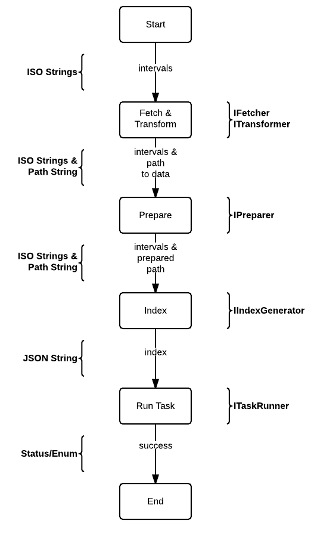

php-druid-ingest
===============

Experimental PHP wrapper around ingesting data from a variety of data sources into [Druid](http://druid.io) as
a data source.

Overview
---------------

The wrapper lives in the namespace `PhpDruidIngest`.

Classes provide for the various tasks related to the extraction, transformation, and loading of data from
other sources into druid. This involves:

1. the extraction, transformation, and loading of that data
2. preparing it in a place and format ready for Druid
3. the generation of a compatible Druid indexing task
4. the execution of the indexing task
5. usage of the returned job id for monitoring of the indexing task job, and
6. removal of prepared ingestion data after Druid has finished ingesting the file.


When executed, this will need to live on the Druid node that will ingest the data, using `LocalFilePreparer`.
Otherwise it will need a way to move or stream the file from itself to the destination Node (say via `scp`).
`RemoteSCPPreparer` is an initial stab at this.


Design
---------------

1. Instantiate a `IFetcher`, configured to fetch the desired records for the desired time periods.
1. Instantiate a `IPreparer` to record the results in memory or in file, tranfser results to destination, returning the destination path
1. Instantiate a `IDruidQueryParameters`, configured with parameters. <-- was dimension definition, now index task params + path from IFetcher
1. Instantiate a `IDruidQueryExecutor`, configured to hit a Druid endpoint.
1. Instantiate a `IDruidQueryGenerator`. <-- index task generator
1. Instantiate a `IDruidQueryResponseHandler`. <-- gets the task id
1. Run the `IDruidQueryExecutor`'s `executeQuery` function with the IDruidQuery, getting the result.
1. Hand the resulting task id to `IDruidJobWatcher` who polls until task succeeds or finishes
1. `IPreparer` then cleans up left over ingestion file

Fetchers are the most interesting element in play here. By adding new Fetchers we can support new input sources.
Initially we are using `mysqli` to handle fetching from MySQL databases. Fetching from HTTP endpoints, or a log, or running
map/reduce or storm and getting the results results are all good ideas for other fetchers.

Please refer to this diagram for an overview of how this works underneath the hood:



(From this [Dynamic LucidChart Source URL](https://www.lucidchart.com/publicSegments/view/542c8edd-b500-4dc7-b37f-7a010a0048fd/image.png))


How to Test
-------------

From the root directory, in a command terminal run: `php vendor/bin/phpunit tests` or more preferably `php vendor/bin/phing`.


Generate Documentation
-------------

From the root directory, in a command terminal run: `php vendor/bin/phing docs`.


How to Install
---------------

Right now, there is no tagged version. To be ready for it when it comes, branch-aliases are in place.

- Stable branch: `~1.0@dev`
- Stable branch w/ PHP 5.3 Compatibility Support: `dev-php-53-compat`
- Cutting edge: `~1.1@dev`

To install, it is suggested to use [Composer](http://getcomposer.org). If you have it installed, then the following instructions
in a composer.json should be all you need to get started:

If you are using PHP 5.3, there [is](https://bugs.php.net/bug.php?id=66818) [a](http://php.net/archive/2014.php#id2014-08-14-1) [bug](https://bugs.php.net/bug.php?id=43200) and you will need to use an alternative branch.

Up to date PHP:

```json
{
    "repositories": [
        {
            "type": "vcs",
            "url": "git@github.com:r4j4h/php-druid-ingest"
        }
    ],
    "require": {
        "r4j4h/php-druid-ingest": "~1.0@dev"
    }
}
```

PHP 5.3 Compatibility:

```json
{
    "repositories": [
        {
            "type": "vcs",
            "url": "git@github.com:r4j4h/php-druid-ingest"
        }
    ],
    "require": {
        "r4j4h/php-druid-ingest": "dev-php-53-compat"
    }
}
```

Once that is in, `composer install` and `composer update` should work.

Once those are run, require Composer's autoloader and you are off to the races:

1. `require 'vendor/autoload.php';`


References
---------------

- [php-druid-query](https://github.com/r4j4h/php-druid-query)
- [Druid](http://druid.io)
- [Composer](http://getcomposer.org)
- [Guzzle](http://guzzle.readthedocs.org)
